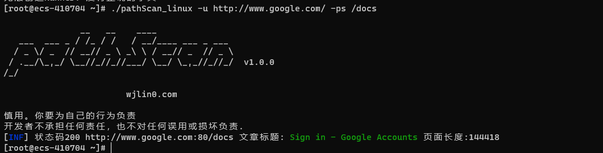

#
pathScan 是一个用Go编写的路径扫描工具，它允许您快速可靠的扫描URL地址。这是一个非常简单的工具。

## 特征



- 快速发现路径
- 可远程加载目标或远程加载字典
- 丰富的内置字典
- 可恢复上次扫描进度
- 支持使用HTTP/SOCKS代理
- 智能识别目标地址 (example.com 和http://example.com/ 以及http://example.com 都不会报错)
## 用法
```shell
pathScan -h
```
```yaml
Usage:
  ./pathScan_linux [flags]

Flags:
输入:
   -u, -url string[]        目标(以逗号分割)
   -uf, -url-file string[]  从文件中,读取目标
   -ur, -url-remote string  从远程加载目标
   -resume string           使用resume.cfg恢复扫描

扫描字典:
   -ps, -path string[]       路径(以逗号分割)
   -pf, -path-file string[]  从文件中,读取路径
   -pr, -path-remote string  从远程加载字典

输出:
   -o, -output string  输出文件路径（可忽略）
   -nc, -no-color      无颜色输出
   -vb, -verbose       详细输出模式
   -sl, -silent        只输出状态码为200

配置:
   -rs, -retries int        重试3次 (default 3)
   -p, -proxy string        代理
   -pa, -proxy-auth string  代理认证，以冒号分割（username:password）

速率:
   -rl, -rate-limit int  线程(默认150) (default 150)
```
## 安装

下载准备运行的二进制文件或使用 GO 安装
### GO
```shell
go install -v 
```